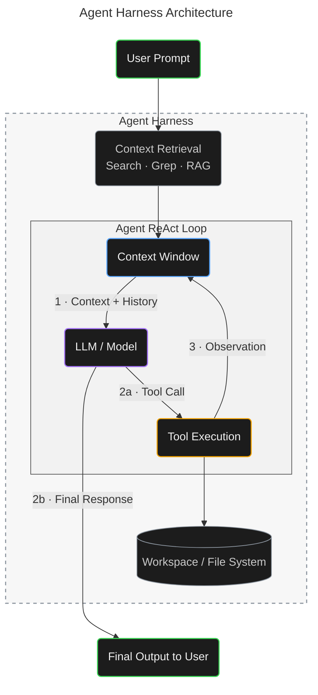

  

  

<strong>How it works</strong>

The diagram illustrates a modern agent harness workflow in which a user prompt is first enriched through context retrieval using search, grep, or RAG. That context enters a ReAct loop, where the model evaluates the available context, decides whether to invoke tools, and receives the resulting observations back into its context window for further reasoning.

Tool execution can interact with a persistent workspace or file system, allowing the agent to read, modify, and operate on external state. This cycle can repeat as needed until the model has enough information to produce the final response to the user.

