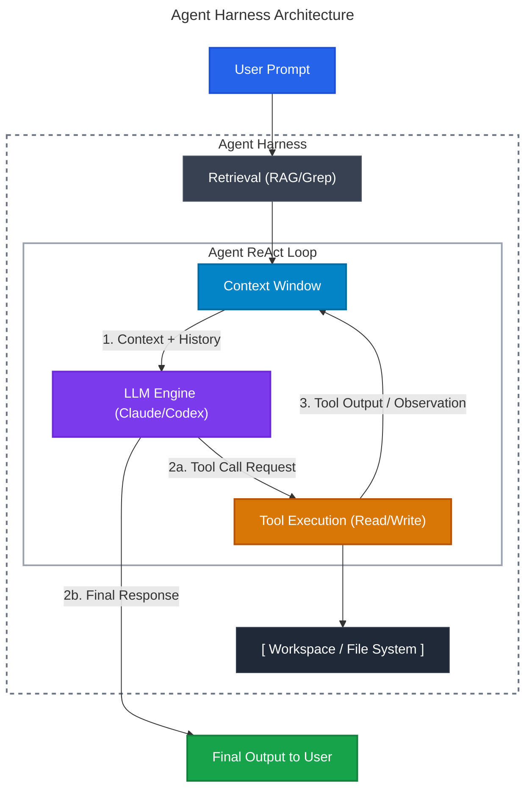

  

  

```mermaid
---
title: Agent Harness Architecture
---
graph TD
    User["User Prompt"] --> RAG

    subgraph Harness["Agent Harness"]
        RAG["Retrieval (RAG/Grep)"] --> CW
        
        subgraph Loop["Agent ReAct Loop"]
            CW["Context Window"] -->|"1. Context + History"| LLM["LLM Engine (Claude/Codex)"]
            LLM -->|"2a. Tool Call Request"| TE["Tool Execution (Read/Write)"]
            TE -->|"3. Tool Output / Observation"| CW
        end

        TE --> WorkSpace["[ Workspace / File System ]"]
    end

    %% The lengthened arrow (---->) forces FinalAnswer down multiple ranks %%
    LLM ---->|"2b. Final Response"| FinalAnswer["Final Output to User"]
    WorkSpace ~~~ FinalAnswer

    %% Explicit Color Styles %%
    style User fill:#2563eb,stroke:#1d4ed8,color:#ffffff,stroke-width:2px
    style FinalAnswer fill:#16a34a,stroke:#15803d,color:#ffffff,stroke-width:2px
    style LLM fill:#7c3aed,stroke:#6d28d9,color:#ffffff,stroke-width:2px
    style CW fill:#0284c7,stroke:#0369a1,color:#ffffff,stroke-width:2px
    style TE fill:#d97706,stroke:#b45309,color:#ffffff,stroke-width:2px
    style RAG fill:#374151,stroke:#4b5563,color:#ffffff,stroke-width:1px
    style WorkSpace fill:#1f2937,stroke:#374151,color:#ffffff,stroke-width:1px
    style Harness fill:none,stroke:#6b7280,stroke-width:2px,stroke-dasharray: 5 5
    style Loop fill:none,stroke:#9ca3af,stroke-width:2px
```
